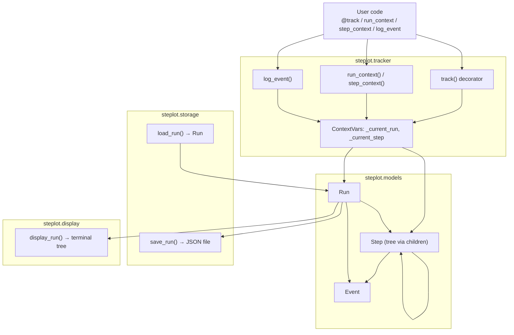

# steplot

Lightweight agent step tracker with decorator and logging support.

`steplot` helps you visualize and persist the execution flow of your AI agents,
scripts, or any multi-step pipeline. Wrap functions with `@track`, emit log
events with `log_event`, and render a tree of steps to the terminal or to a
JSON file.

## Features

- `@track` decorator -- wraps any function in a timed `Step`.
- `run_context` / `step_context` -- context managers for nesting.
- `log_event` -- emit structured events into the current step.
- `display_run` -- pretty-print a run tree to the terminal.
- `save_run` / `load_run` -- persist runs as JSON.

## Installation

**Requirements:** Python 3.12 or newer. steplot has no runtime dependencies.

### From PyPI

```bash
pip install steplot
```

### From source (editable install)

Clone the repository and install it in editable mode:

```bash
git clone https://github.com/MohammadaminAlbooyeh/steplot.git
cd steplot
pip install -e .
```

### Development install

To work on steplot itself, install the optional `dev` extras (pytest, ruff, mypy):

```bash
pip install -e ".[dev]"
```

Then run the checks used in CI:

```bash
ruff check steplot tests examples
ruff format --check steplot tests examples
mypy steplot tests
pytest
```

### Verifying the install

```bash
python -c "import steplot; print(steplot.__version__)"
```

## Quick start

```python
from steplot import track, run_context, display_run

@track
def research(topic: str) -> str:
    return f"papers about {topic}"

@track
def summarize(papers: str) -> str:
    return papers.upper()

with run_context("my-agent") as run:
    papers = research("transformers")
    summary = summarize(papers)

display_run(run)
```

Output:

```
╔══ Run: my-agent  [0.02s] ═══
║
║  ├─ research  [0.01s]
║  └─ summarize  [0.00s]
╚════════════════════════════╝
```

## Nested steps

```python
from steplot import run_context, step_context

with run_context("pipeline") as run:
    with step_context("fetch"):
        ...
    with step_context("process"):
        with step_context("validate"):
            with step_context("score"):
                ...
```

## Persisting runs

```python
from steplot import save_run, load_run

save_run(run, "steplot/runs/run-1.json")
loaded = load_run("steplot/runs/run-1.json")
```

## Architecture

steplot is organized into four small modules, each with a single responsibility:

```text
                              User code
              (@track, run_context, step_context, log_event)
                                  │
                                  ▼
                        ┌───────────────────┐
                        │  steplot.tracker   │
                        │────────────────────│
                        │ ContextVars:       │
                        │  _current_run      │
                        │  _current_step     │
                        │                    │
                        │ track()            │
                        │ run_context()      │
                        │ step_context()     │
                        │ log_event()        │
                        └─────────┬──────────┘
                                  │ creates / mutates
                                  ▼
                        ┌───────────────────┐
                        │  steplot.models    │
                        │────────────────────│
                        │  Run               │
                        │   ├─ Step ─┬─ Step │  (tree via .children)
                        │   │        └─ ...  │
                        │   ├─ Event         │  (on Run or any Step)
                        │   └─ ...           │
                        └───┬─────────────┬──┘
                            │             │
                 reads/writes         read-only
                            │             │
                            ▼             ▼
                ┌────────────────┐  ┌────────────────┐
                │ steplot.storage │  │ steplot.display │
                │─────────────────│  │─────────────────│
                │ save_run()      │  │ display_run()   │
                │  Run -> JSON    │  │  Run -> terminal│
                │ load_run()      │  │  tree output    │
                │  JSON -> Run    │  │                 │
                └────────────────┘  └────────────────┘
```

Rendered version (GitHub renders this as an actual diagram):



**How it fits together:**

- `steplot.models` defines the data: `Run` is the top-level container, `Step` nodes form a tree via `children`, and `Event` records are attached to either a `Run` or a `Step`.
- `steplot.tracker` holds the runtime state (`ContextVar`s for the current run/step, async-safe) and exposes the public API: the `@track` decorator, `run_context`/`step_context` context managers, and `log_event`. All of them read/write the same `Run`/`Step` tree defined in `models`.
- `steplot.storage` serializes a `Run` tree to JSON (`save_run`) and deserializes it back (`load_run`), with no dependency on the tracker's runtime state.
- `steplot.display` walks a `Run` tree read-only and renders it as a boxed tree in the terminal.

Only `models.Run`/`Step`/`Event` are shared across modules — `tracker`, `storage`, and `display` each depend on `models` but not on each other, so a `Run` produced live via `run_context` and one loaded from disk via `load_run` behave identically to `display_run`.

## API reference

### `track`

```python
@track
def my_step(): ...

@track(step_name="custom", capture_args=True)
def another_step(x, y): ...
```

### `run_context`, `step_context`

Context managers that create and automatically finish a `Run` or `Step`.

### `log_event`

```python
import logging
from steplot import log_event

log_event(logging.INFO, "processing item", item_id=42)
```

### `display_run`

Prints a tree of steps and events to stdout.

## License

MIT